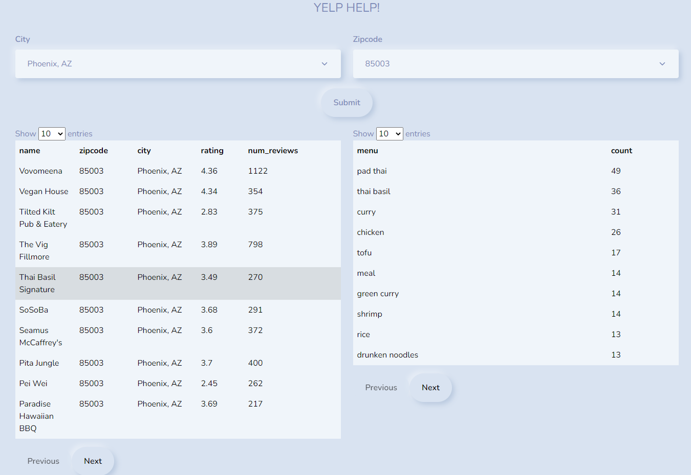

<div align="center">

# Yelp Help!

</div>

The project consists of three parts.
- Scrapers (Scrapes data from Yelp.com) 
- NER model (Model training and inference to get menu items - `Pseudo-menus`)
- Web app (Can be used by consumers to look at the generated menus by entering city and zipcode)

<br>

> Pseudo-menu: This is not the typical menu that we see in restaurants where they might have their own obscure names for common food items. For example "Eggs can’t be cheese" this is a burger. So our Pseudo-menu will just have one menu item named "burger".

<br>

<div align="center">

# Yelp data scraper 
</div>

_*Scrape business information, reviews, menus ( if available ) and top food items for all the restaurants from a particular city/location.*_

## Installation
> Currently the code is tested on `Python 3.6.5`

``` console
$ git clone https://github.com/Sapphirine/202112-51-YelpHelp.git
$ cd scrapers
```

Then, create a virtual environment

``` console
$ conda create --name yelp_scrapers python=3.6.5
```

Activate your environment and install required dependencies from requirements.txt

``` console
$ conda activate yelp_scrapers
$ pip install -r requirements.txt
```

Then, setup database by first creating `.env` file using example `.env.example` file and then run the following command

``` console
$ alembic upgrade head
```

After installation, run the scrapers by using following command

``` console
$ python run_scraper.py --locations-file-path "locations.csv"
```

For information about positional arguments and available optional arguments,

``` console
$ python run_scraper.py --help
usage: run_scraper.py [-h] [--locations-file-path LOCATION_FILE_PATH]
                      [--scrape-reviews SCRAPE_REVIEWS]
                      [--business-pages BUSINESS_PAGES]
                      [--reviews-pages REVIEWS_PAGES]

optional arguments:
  -h, --help            show this help message and exit
  --locations-file-path File path containing locations 
  --scrape-reviews      Scrape reviews? (yes/no)
  --business-pages      Number of business listing pages to scrape (> 0)
  --reviews-pages       number of pages of reviews to scrape for each business (> 0)
```
>__`--locations-file-path`__ - csv file containing location names. column name should be "location"

>__`--scrape-reviews`__ - flag is used to specify whether or not to scrape reviews along with menu URLs and top food items (used in `yelp_reviews_spider.py`).

>__`--business-pages`__ - specifies number of pages to scrape data from. For example if, for `Chicago, IL` we got 50 pages worth of businesses listings and, if this argument is set to 5 then only first 5 pages will be scraped out of 50. (used in `yelp_businesses_spider.py`)  

>__`--reviews-pages`__ - similar to `--business-pages` but for reviews (used in `yelp_reviews_spider.py`)  


## Code structure and Data flow

When the code is executed as mentioned in above section, 3 crawlers scrapes data _*sequentially*_. `The order of crawl is important` here, since, data scraped in one crawler is used by another.

>yelp_businesses_spider &#8594; yelp_reviews_spider &#8594; yelp_menu_items_spider

__Note:__ The reviews crawler and Menus crawler cannot run simultaneously, because the menu URLs are only available after we run reviews crawler.  

### __1. yelp_businesses_spider__ :

The business crawler scrapes following information for each restaurant:
    
    business_id 
    business_name 
    business_url 
    overall_rating 
    num_reviews 
    location 
    categories
    phone_number

All the scraped data is relayed to `pipelines` where it is persisted in `PostgresDB` in `restaurants_info` table

__Note:__ The `restaurants_info` table also contains information about state of reviews crawler, Menu URLs and Menu scraped flag and Top food items, which will be populated by following crawlers.

### __2. yelp_reviews_spider__ :

The reviews crawler scrapes following information for each review :
    
    review_id 
    review 
    date 
    rating 
    business_name 
    business_id 
    business_alias
    business_location # same as the one provided as CLI input
    sentiment # if rating >= 4 then 1 else 0

All the scraped data is relayed to `pipelines` where it is persisted in `GCP Bucket` partitioned by location and chunked by time

As mentioned before the crawler also persists the state of review scraper in the `restaurants_info` table in `last_reviews_count` and `errors_at` columns.

Apart from all these, the crawler also scrapes `menu URL` and `Top food items` and persists them in `menu_url` and `top_food_items` columns respectively in the `restaurants_info` table.

__Note:__ All the scraped reviews are stored in Gzipped Json lines format in chunks on 1000 and is handled by `pipelines`. While, all other data is being stored in db in the same code.


### __3. yelp_menu_items_spider__ :

The menu items crawler scrapes following information for each restaurant (if available) :
    
    url 
    menu # Postgres JSON format

All scraped menus data is relayed to `pipelines` where they are persisted in `PostgresDB` in `restaurants_menus` table

The crawler also sets `menu_items_scraped_flag` in the `restaurants_info` table and this is done in the same script.


<br>

<div align="center">

# Web App
</div>

## Installation
To run the web server, open your terminal and go to `webapp/backend`

Create a virtual environment

``` console
$ conda create --name yelp_api python=3.6.5
```

Activate your environment and install required dependencies from requirements.txt

``` console
$ conda activate yelp_api
$ pip install -r requirements.txt
```

After installation, you can start the server and see the results from local host on port 7777

``` console
$ python yelp_help_api.py
```
Then, open `index.html` file from the `frontend` folder.


